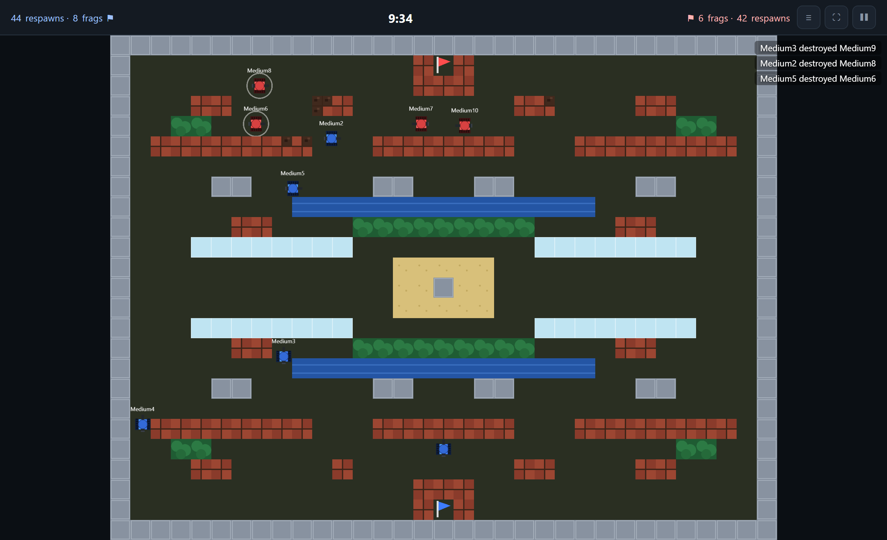
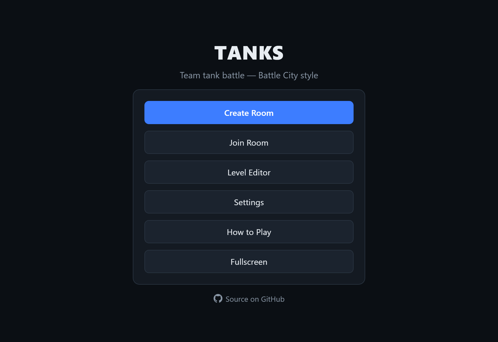
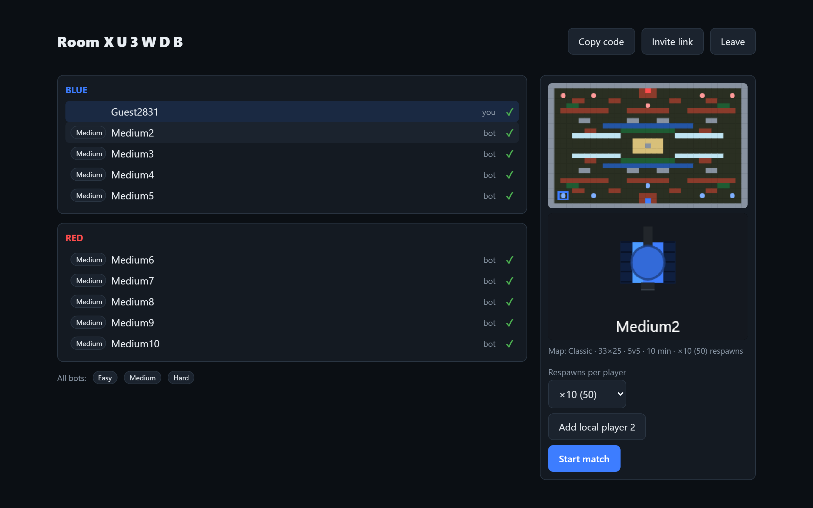
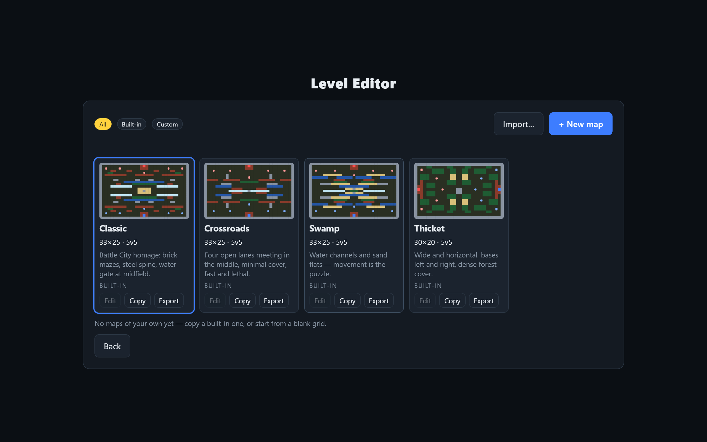
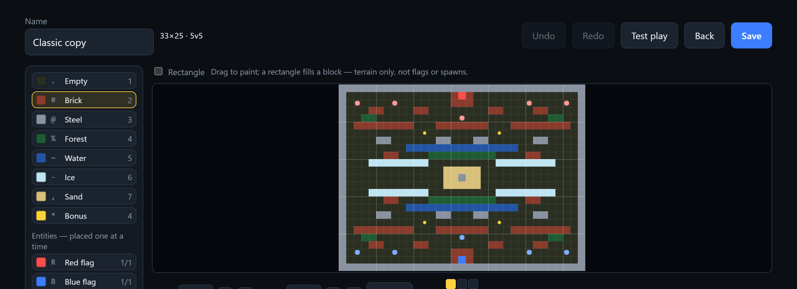
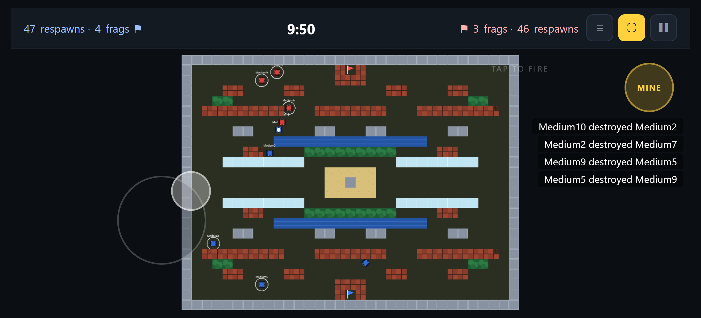
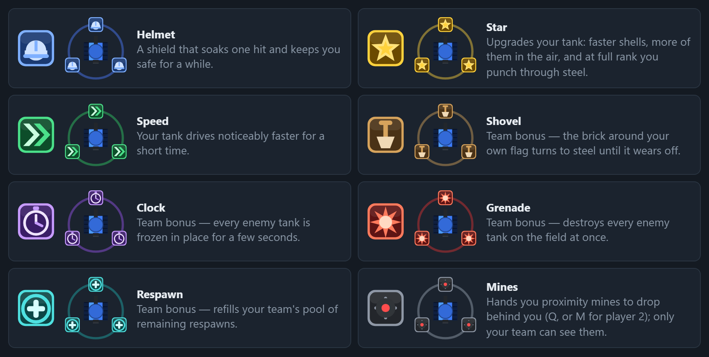

<div align="center">

# 🛡️ TANKS

**A browser team tank battle in the spirit of _Battle City_ — destructible terrain, power-ups,
and a flag you have to defend.**

[](https://gray0072.github.io/tanks/)

[](https://www.typescriptlang.org/)
[](https://pixijs.com/)
[](https://peerjs.com/)
[](https://vitejs.dev/)




</div>

---

Blue against red, as many tanks a side as the map puts spawn points. Bring friends over a
6-character room code, hand a second player the arrow keys on your own machine, or take on a team of
bots — every slot nobody claims is filled by one. Runs in any modern browser, desktop or phone,
with no server, no install and no account.

> **Status: playable prototype.** A full local match works today: menu → room → a live match with
> terrain, bonuses, flags and bots, plus a level editor and a headless test suite (`npm test`).
> Multiplayer (PeerJS) is implemented but not yet verified across two real devices over the
> internet; the touch controls are verified in an emulated phone browser, not yet on real hardware.
> [SPEC.md](SPEC.md) indexes the authoritative design; [§13 Plan](specs/plan-and-risks.md#13-plan)
> lists what's left.

## Highlights

|  |  |
|---|---|
| 🧩 **Teams sized by the map** | The roster is the map's spawn count, not a fixed number — a 1v1 test arena and a 16-a-side brawl are the same engine, and every free slot is filled by a bot |
| ⚔️ **Team battle with an objective** | Destroy the enemy flag for an instant win, or grind the enemy out of respawns before the 10-minute clock runs out |
| 🤖 **Bots on every free slot** | Easy / Medium / Hard, set per bot or for the whole roster — genuinely different tactics, not just better aim |
| 🧱 **Destructible terrain** | Brick crumbles cell by cell, steel resists until you're upgraded, forest conceals, water stops tanks but not bullets, ice slides, sand slows |
| ✨ **Eight power-ups** | Four are yours, four swing the whole team |
| 🌐 **Peer-to-peer multiplayer** | Join by 6-character code or invite link over WebRTC — no server to run, no public IP, no accounts |
| 🕹️ **Two players, one keyboard** | WASD and the arrow keys, same team or opposite ones |
| 🗺️ **Four maps + a level editor** | Paint your own arena, validate it, play it — and it travels to your guests over the wire |
| 📱 **Phone-ready** | Split-screen touch controls and a real fullscreen mode, the whole arena on screen |

## Gallery

<table>
<tr>
<td width="50%"><br><sub><b>Main menu</b> — create, join, edit, play</sub></td>
<td width="50%"><br><sub><b>Room</b> — claim a slot, live map + spawn preview, per-bot difficulty</sub></td>
</tr>
<tr>
<td><br><sub><b>Map library</b> — built-ins and your own maps, side by side</sub></td>
<td><br><sub><b>Level editor</b> — paint terrain, place flags and spawns, resize, test play</sub></td>
</tr>
<tr>
<td colspan="2"><br><sub><b>On a phone</b> — a stick appears under whichever thumb lands on the movement half; tap anywhere on the other half to fire</sub></td>
</tr>
</table>

## Power-ups

Bonuses drop on the battlefield now and then — drive over one to take it. While a bonus is on you,
its icon spins around your tank in that bonus's colour, so everyone can see what you picked up.



`HELMET` `STAR` `SPEED` `MINE` are yours alone; `SHOVEL` `CLOCK` `GRENADE` `RESPAWN` swing your
whole team.

## How a match goes

1. **Create a room** — pick the map, time limit, respawns and default bot difficulty. You get a
   6-character code and an invite link.
2. **Take a slot** — click any slot on either team; the preview shows the map, your spawn and your
   tank. Friends join with the code; bots hold everything nobody claimed.
3. **Fight** — the host's browser simulates everything and streams snapshots to the guests at 20 Hz.
4. **Win** — blow up the enemy flag, or outlast them on respawns. The result screen has the full
   scoreboard and a way straight back to the room.

## Controls

| Action | Player 1 | Player 2 (same machine) |
|---|---|---|
| Move | `W` `A` `S` `D` | Arrow keys |
| Fire | `Left Shift` | `Right Shift` |
| Drop mine (needs the `MINE` bonus) | `Q` | `M` |
| Scoreboard | hold `Tab` | |
| Menu / pause | `Esc` | |

Hold two direction keys at once to drive diagonally. In the menus, `Enter` triggers the screen's
primary button. `Esc` opens the in-match menu — playing on your own that really pauses, with the
simulation stopping dead and picking up where it left off; with other players connected the match
can't be frozen, so it's just a menu over a running game.

<details>
<summary><b>On a phone or tablet</b> — the battlefield is split in half and each half <i>is</i> a control</summary>

<br>

- **Movement half** (left by default) — put a thumb down anywhere in it and drag. A stick appears
  under your thumb, wherever that is, and the tank drives that way in any of 8 directions. Lift to
  stop. Drag far and the stick follows you, so you never run out of travel or have to re-grab.
- **Fire half** (right by default) — tap anywhere to fire, hold to keep firing. The tank shoots where
  it faces, so there's nothing to aim and no button to find.
- **`MINE`** sits in the outer top corner, the only fixed button — out of the way of the firing thumb.
- Left-handed? *Settings → Movement stick side* swaps the two halves and the `MINE` button with them.
- The top bar carries the three buttons a phone needs and a keyboard doesn't: scoreboard, fullscreen,
  and the pause menu.

Landscape only — portrait shows a rotate prompt.

**Fullscreen** is how it's meant to be played on a phone: browser chrome eats a fifth of a landscape
screen and its show/hide animation resizes the arena mid-fight. Starting a match on a touch device
goes fullscreen and asks for a landscape orientation lock automatically (*Settings → Fullscreen on
match start*, on by default). It's also a button in the match top bar and on the main menu — worth
knowing, since a phone has no `Esc` to get back out with.

</details>

## Maps and the level editor

Four maps ship with the game — `classic`, `crossroads`, `swamp` and `thicket` — chosen by the host
in the lobby and previewed live, with your spawn point highlighted, before the match starts.

A map is a plain block of text and carries its own size and roster, anything from 2×2 up to
128×128, so the team size comes from the map rather than the other way round. Build your own in the
**Level Editor**: paint terrain with a Paint-like palette, drag to fill rectangles, place flags,
spawns and bonus points, resize the grid around any anchor, undo a gesture at a time, and hit
**Test play** to drop straight into a match on it. A map is validated before it can be played, so an
unplayable one never reaches a match. Built-in maps are read-only but can be copied. Custom maps live
in `localStorage`, export and import as text, and travel to your guests over the wire when you host
on one.

## Playing together

One player creates a room and gets a code like `K7QM2X` (or an invite link `?room=K7QM2X`). Everyone
else joins with it, picks a slot on either team — the preview shows the map, your spawn point, and
your tank before you commit — and hits ready. Any slot you don't fill is played by a bot, so the
teams are always full whether there are two of you or ten. Clicking another slot moves you there;
your own seat always keeps a slot, so you can't accidentally drop yourself out of the roster.

The room creator hosts the match: their browser runs the authoritative simulation and all the bots.
If someone drops, a bot takes their tank over for the rest of the match.

Your lobby setup sticks, too: Create Room reopens on the map you played last, and each map keeps its
own time limit, respawn pool, bot difficulty and friendly-fire toggle.

## Quick start

```bash
npm install
npm run dev        # http://localhost:5173/tanks/
npm run build      # type-check + production build into ./dist
npm run preview    # serve the build locally
npm run deploy     # publish ./dist to the gh-pages branch
npm run maps:check # validate the built-in maps in src/world/maps/
npm test           # headless suite — movement, map format, editor, bots
```

`vite.config.ts` sets `base: "/tanks/"`, the repo subpath GitHub Pages serves from — which is also
why `npm run dev` opens at <http://localhost:5173/tanks/> rather than the bare root. Pushing to
`main` deploys automatically via [.github/workflows/deploy.yml](.github/workflows/deploy.yml);
`npm run deploy` publishes from your machine instead. The build is a plain static site — `./dist/`
can be hosted anywhere that serves it from `/tanks/`.

## Tech

**TypeScript** · **PixiJS** (WebGL rendering) · **PeerJS** (WebRTC DataChannel) · **Vite** ·
static hosting on **GitHub Pages**. No backend, and no shipped art — every texture, from the tanks
to the power-up icons, is generated procedurally at boot.

<details>
<summary><b>Project structure</b></summary>

```
src/
  main.ts            # entry: debug shortcut, ?room= deep link, or the main menu
  game/              # screens (menu, create, join, room, match, result, settings, editor)
    config.ts        # every tuning number: speeds, timings, bot profiles, editor limits
  world/             # the simulation — no rendering, no DOM, no network
    sim.ts           # authoritative tick: movement, bullets, bonuses, flags
    grid.ts bullet.ts bonus.ts flag.ts rules.ts tank.ts
    maps/            # map sources as text, parser/validator, editor model, custom-map library
  ai/                # bots: per-tank controller, pathfinder, team role planner
  net/               # RoomHost / RoomClient behind one RoomController interface
    peer.ts          # PeerJS plumbing; protocol.ts — wire messages
  render/            # PixiJS: arena, procedurally generated atlas, HUD, previews, bonus art
  util/              # input, audio, fullscreen, math, storage, dialog helpers
tests/               # headless node:test suites
scripts/             # map validation and the test runner
docs/screenshots/    # the images in this README
```

</details>

<details>
<summary><b>Docs</b></summary>

<br>

- [SPEC.md](SPEC.md) — the authoritative design, an index over the section files in [specs/](specs/).
- [specs/level-editor.md](specs/level-editor.md) — the editor's own detail sheet.
- [AGENTS.md](AGENTS.md) — working notes: current status, how to launch and verify the game.

</details>

## Roadmap

Milestones **M0 – M10** are laid out in [§13 Plan](specs/plan-and-risks.md#13-plan).

- [x] **M0–M6** — scaffold, terrain, tanks, match rules, bots, bonuses, screens + local co-op
- [x] **M7** — multiplayer (PeerJS star topology, room code, host-authoritative sim) — *implemented,
      not yet played across two real devices*
- [x] **M8** — mobile touch controls, fullscreen and the orientation gate — *verified in an emulated
      phone browser, not yet on real hardware*
- [x] **Level editor** — paint, validate, save, share; custom maps over the network
- [ ] **M9** — `fortress` and `iceworks` maps, real audio mixing pass, effects/kill-feed polish, balance
- [ ] **M10** — first playtest round

Deliberately **not** planned: host migration, dedicated servers, accounts and ranking, matchmaking,
replays. See [§15 Out of scope](specs/plan-and-risks.md#15-out-of-scope).

## License

[MIT](LICENSE).

## Credits

Inspired by *Battle City* (Namco, 1985).
